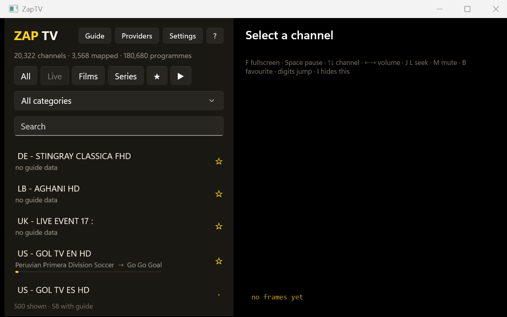

# ZapTV

A Windows IPTV player for people who already have a provider and are tired of the app that
came with it.

Live TV, films and series from an Xtream Codes account, with a real electronic programme
guide, a search that answers while you type no matter how large the library is, and
automatic failover when a stream dies mid-programme.

Built for .NET 10 and WinUI 3, with video decoded by libmpv and presented through a shared
GPU texture. x64 and ARM64.



*The video pane is deliberately empty. A screenshot of live television would put somebody
else's copyrighted broadcast in this README.*

> **Status: working, unsigned, and version 0.1.0.** It plays television every day on the
> machine it was built on. It has never run on a second machine, an ARM64 device, or a
> second provider. Read [What is not done](#what-is-not-done) before relying on it.

---

## Why this exists

The apps bundled with IPTV subscriptions tend to share the same faults: a channel list that
takes seconds to filter, a guide that is empty for most channels, a search that only matches
the beginning of a title, and a dead stream that shows a spinner until you change channel
yourself. None of those are hard problems. They are just nobody's priority.

So this is one person scratching one itch, with the specific irritations written down as
measurable targets — 80ms per keystroke for search, under a second to change channel, under
ten seconds to recover from a stream that dies — and then measured rather than assumed. Most
of the interesting decisions in this repository come from a measurement contradicting an
assumption. Those are written down in [`docs/decisions/`](docs/decisions/).

---

## Bring your own source

**ZapTV ships no content.** No bundled playlists, no sample provider, no default server, no
channel directory, no discovery of any kind. There is nothing to watch until you enter
credentials you already have. This is a standing constraint in the specification, not a
feature that has not been built yet.

A media player is a general-purpose tool, the way VLC or a web browser is. This one is
useful with any Xtream Codes or M3U/XMLTV source, and those include telco IPTV services,
legitimate subscription providers, free-to-air and public broadcaster streams, and
self-hosted setups. What you point it at is your business and your responsibility.

Being straight about it: the Xtream Codes ecosystem also contains a great many unlicensed
resellers. That is exactly why the line here is drawn at *shipping no sources and helping you
find none*. If you are looking for somewhere to get channels, this repository will not help
you, and no contribution that changes that will be accepted.

---

## Install

Download from [Releases](../../releases):

| File | For |
|---|---|
| `ZapTV-<version>-win-x64-Setup.exe` | Most Windows PCs |
| `ZapTV-<version>-win-arm64-Setup.exe` | ARM64 devices (Surface Pro X, Snapdragon laptops) |
| `ZapTV-<version>-win-x64-portable.zip` | A folder you can run from anywhere, including a USB stick |

Take the build that matches your machine. The x64 binary in an ARM64 install fails at load
time with an error that reads as a missing dependency rather than an architecture mismatch,
which is a bad half hour to spend.

**The builds are not code signed.** SmartScreen will warn on first run: *More info* →
*Run anyway*. Signing requires an OV or EV certificate, and both now mandate that the key
lives on a hardware token, so this waits on someone buying and provisioning one.

Expect about **337MB installed** and a **133MB download**. Most of that is libmpv and two
self-contained runtimes. Updates are delta-patched — one build to the next moved **176KB**.

Then open Settings, add your provider's URL, username and password, and sync.

---

## What it does

### Live television
- Browsable by the provider's own categories, searchable, and favouritable from any row —
  and it stays responsive at the tens of thousands of channels a large account carries.
- Now and next against each channel, with a progress bar for the programme on air.
- Automatic failover: when a stream dies, another copy of the same channel is opened without
  you touching anything.
- Channel changes are paced to your account's real concurrent-stream limit, read from the
  account rather than guessed. Exceeding it is how accounts get blocked.

### Films and series
- Films and series drawn as poster grids, with a lettered placeholder behind every cover so
  the ones a provider never supplied artwork for still read as distinct tiles.
- Series open into seasons, seasons into episodes. A show with one season skips the season
  menu rather than making you click through a list of one.
- Resume: anything you started and did not finish appears under Continue, with the position
  read at play time rather than when the row was drawn.

### The guide
- A scrolling EPG grid, virtualised on both axes, so it opens at the same speed against a
  guide of any size.
- The guide refreshes itself when it runs short, rate-limited so a restart loop cannot
  hammer the provider.
- Mappings are never written when the match is ambiguous. A wrong guide is worse than a
  missing one.

### Search
- One FTS5 index across channels, films, series and programme titles.
- Each tab searches what it lists — looking for a channel in the Live tab does not return
  nine hundred films — and the **All** tab searches everything at once.

### The player
- Hardware decode by default with automatic software fallback, DPI-correct at any scale,
  and resizable without corruption.
- Keyboard and remote: `F` fullscreen, `Space`/`K` pause, `←→` volume, `↑↓` or PageUp/Down
  channel, `J`/`L` seek, `M` mute, `B` favourite, `/` search, `I` info, digits jump to a list
  position. Media keys work, because an HTPC remote presents as a keyboard.
- Audio and subtitle track pickers, and a transport bar for films and episodes — hidden for
  live, which has no end to scrub towards.

### Diagnostics
A panel nothing else on the market seems to have: per-provider success rate and time to
first frame, guide coverage and how far ahead it reaches, decode backend actually in use,
and playback outcomes over the last seven days. Every number is measured, and
`harness diagnostics` prints the same view model to a console so it can be checked without
reading it off a screenshot.

---

## How it is built

```
Iptv.Core          Platform-neutral (net10.0). Ingest, parsing, EPG matching,
                   failover policy, data access. Never references UI.
Iptv.Presentation  Platform-neutral view models. Testable without the Windows workload.
Iptv.Mpv           Windows. libmpv P/Invoke, OpenGL render context, GPU interop.
Iptv.App           Windows. WinUI 3, unpackaged.
Iptv.Harness       Windows. Console. Times ingest and drives real playback.
```

Dependencies point inward. `Iptv.Core` referencing a UI package fails the build with
`IPTV0001`, and `Iptv.Presentation` targeting a Windows framework fails with `IPTV0003` —
because a view model that needs the Windows workload to test is a view model nobody tests.

### Video

libmpv exposes exactly two render backends, `opengl` and `sw`. There is no D3D11 render API
and never was; the original design assumed one and had to be rewritten
([0001](docs/decisions/0001-libmpv-render-api.md)). The shipping path is mpv rendering into
an OpenGL framebuffer whose texture is shared with Direct3D 11 via `WGL_NV_DX_interop2`, then
presented through a `SwapChainPanel` ([0002](docs/decisions/0002-video-presentation-path.md)).

`--wid` embedding is prohibited outright. It creates an airspace violation that no z-order
fix resolves, which is why the guide can be drawn over live video at all.

### Data

SQLite with WAL, `STRICT` tables and FTS5, driven by raw ADO.NET on the ingest path — one
prepared command with parameters reset per row. EF Core is allowed for settings and provider
CRUD and forbidden for programme inserts. XMLTV is streamed through `XmlReader`; neither the
guide nor the VOD payload is ever fully in memory.

---

## Measured

Every number below came from running the thing, mostly against a real provider.

| | |
|---|---|
| EPG ingest, 67.5MB guide | **1.3s** parse + insert + swap, 1.6s including indexes, 202MB peak |
| Search across the whole library | **66ms**, down from 8.7–19.8s before the FTS match was bounded |
| Category listing | **3ms**, down from 806ms |
| First frame on a live channel | **~1.0s average** across 94 real attempts |
| Recovery from a stream cut mid-playback | **5.16s**, against a 10s budget |
| Delta update, one build to the next | **176KB** against a 133MB full package |
| Artwork coverage | films 99.0%, series 99.9%, live 98.3% |

The failover number has a story. The first implementation waited for frames to stop, which
meant waiting for mpv's 32MiB buffer to play out first: 8.3s, 12.1s and 19.0s on three
consecutive cuts, scaling with whatever happened to be buffered. Watching the buffer drain
at real time instead detects it in about five seconds regardless
([0012](docs/decisions/0012-stall-detection.md)).

---

## Build from source

Requires the .NET 10 SDK. `global.json` pins the band.

```bash
git clone https://github.com/Arobce/zap.git
cd zap

# libmpv is 120MB and is not committed, so fetch it. Needs 7-Zip.
pwsh ./scripts/fetch-libmpv.ps1

dotnet build
dotnet test
```

The solution builds without libmpv — the tests that need it skip themselves and say so — so
a CI machine or a first clone is never blocked on a 120MB download.

To produce installers:

```bash
pwsh ./scripts/fetch-libmpv.ps1 -Rid both
dotnet tool install -g vpk --version 1.2.0
pwsh ./scripts/publish.ps1 -Version 0.1.0 -Rid both
```

The publish script reads the PE machine field of both the executable and `libmpv-2.dll` and
refuses to package a mismatch, which is the failure [0003](docs/decisions/0003-arm64-feasibility.md)
warned about.

Or push a `v*` tag and let CI do it — see [`.github/workflows/release.yml`](.github/workflows/release.yml).

### The harness

Most of this project was validated headlessly before it had a window. The console harness is
still the fastest way to answer a question about the library:

```bash
dotnet run --project src/Iptv.Harness -- <command>
```

| Command | |
|---|---|
| `sync` | Full catalogue sync, with timings per stage |
| `epg` | Ingest the guide and report parse, insert and index separately |
| `play [search]` | Play a real stream and report what the decoder actually chose |
| `killswitch [x]` | Cut a live stream mid-playback and time the recovery |
| `drill` | Drive a failover offline, against no provider at all |
| `diagnostics` | Print the diagnostics panel |
| `artwork` | How much of the catalogue actually has covers |
| `guide` | The shape of the stored guide, not just its coverage percentage |
| `search [term]` | Time the unified search |
| `probe [urls]` | Ask a host whether your account works on it |

Credentials come from `.local/provider.env`, which is gitignored. Everything printed goes
through a credential scrubber first, because stream URLs carry your username and password in
the path and harness output ends up pasted into issues.

---

## Testing

681 tests: 523 in `Iptv.Core`, 118 in `Iptv.Presentation`, 40 in `Iptv.Mpv`.

Tests that need a GPU or libmpv **skip and say why** rather than passing quietly. That
distinction matters: an earlier version returned early and reported a pass, so a suite where
every GPU test had silently stopped running looked exactly like one where they all worked.

Assertions are written to fail for the right reason. Several in this repository exist because
an earlier version passed for the wrong one — a resume test that a title-derived key would
also have satisfied, a ranking test rescued by an id tiebreak, and a sliding-window check
that only ever worked because synthetic timestamps landed exactly on the boundary.

---

## What is not done

Stated plainly, because a README that only lists what works is a sales page.

- **Never run on a second machine.** Hardware decode is proven on one NVIDIA GPU. Intel and
  AMD paths, the software fallback, and 1080i deinterlacing are all untested against real
  hardware.
- **ARM64 is built and verified, never run.** The package is correct and the binaries are the
  right architecture. No ARM64 device has opened it.
- **Cross-provider failover is unproven.** Failover works and recovers within budget, but only
  ever to another stream from the same provider, because only one account is configured.
- **Unsigned.** Needs a certificate on a hardware token.
- **No update feed.** Velopack is wired in and delta packages are generated, but nothing hosts
  a feed and nothing polls one.
- **No EPG mapping UI.** The specification asks for one. Matching already recovers 99.4% of
  what the guide makes available ([0006](docs/decisions/0006-epg-coverage-ceiling.md)), so a
  manual screen would be work for the remaining fraction.
- **No licence file yet**, which means default copyright applies and nobody has permission to
  do anything with this. That needs deciding.

---

## Decision records

Thirteen of them in [`docs/decisions/`](docs/decisions/), each written when a measurement
contradicted an assumption. The ones worth reading first:

- [0001](docs/decisions/0001-libmpv-render-api.md) — there is no D3D11 render API, and the
  original design depended on one
- [0002](docs/decisions/0002-video-presentation-path.md) — why native WGL beat bundling ANGLE
- [0009](docs/decisions/0009-failover-guard-cost.md) — the safety guard refuses 45.8% of
  failover candidates, and every sampled refusal was a genuinely different channel
- [0010](docs/decisions/0010-guide-horizon.md) — a coverage percentage counts channels with
  *any* guide, which is why the grid was empty while coverage read 16.8%
- [0011](docs/decisions/0011-packaging.md) — what shipping actually costs, and the published
  app that would not start
- [0012](docs/decisions/0012-stall-detection.md) — detecting a cut stream, and a unit test
  that passed for the wrong reason

The full specification is [`IPTV-Player-PRD.md`](IPTV-Player-PRD.md), which remains the source
of truth and has been amended several times when a phase proved it wrong.
